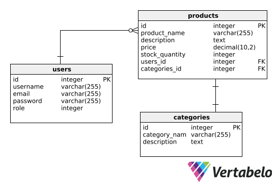

# laravel-commerce

| Name                         | NRP        | Kelas    |
| ---------------------------- | ---------- | -------- |
| Muhammad Ihsan Al Khwaritsmi | 5025221211 | PBKK (D) |
| Arundaya Pratama Nurhasan    | 5025221206 | PBKK (D) |

## Desain database

Database ini terdiri dari tiga tabel: Users, Products, dan Categories. Tabel Users menyimpan informasi pengguna, tabel Products menyimpan detail produk yang ditawarkan, dan tabel Categories mengelompokkan produk ke dalam kategori tertentu. Relasi antara tabel-tabel ini mendukung pengelolaan produk dan pengguna dalam aplikasi.

Tabel ini akan diimplementasikan pada project Laravel. Dengan menggunakan eloquent ORM dan fitur-fitur lain yang didukung dalam framework Laravel.
